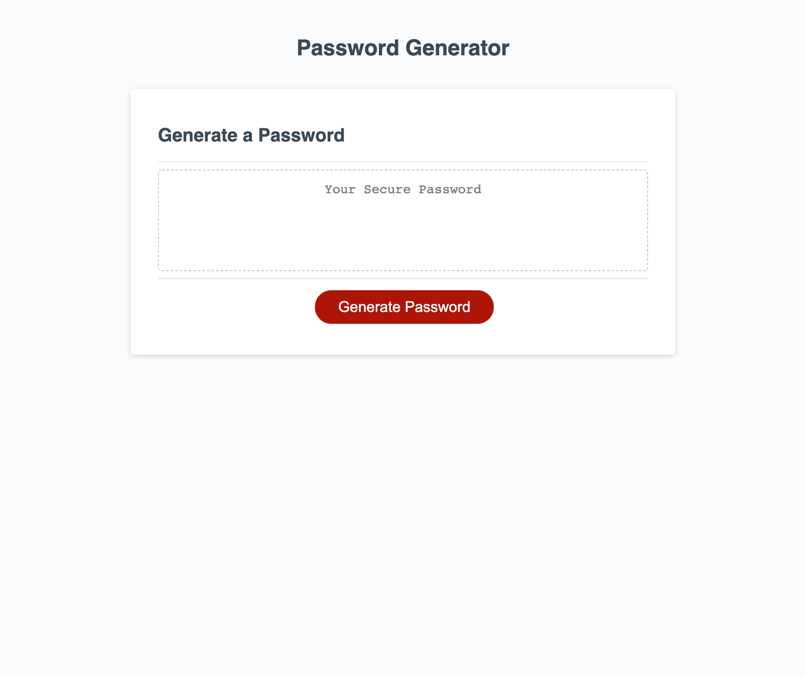

# Password Generator
This Password Generator is an application that an employee can use to generate a random password based on criteria they’ve selected. Criteria options include setting the length of the password between 8 and 128 characters. Employees can also select whether or not the password will include lowercase, uppercase, numeric, and/or special characters. This app will run in the browser, and will feature dynamically updated HTML and CSS powered by JavaScript code.

## Deployment
Password generator is published at https://kristinmoon.github.io/password-generator/

## Author
JS Code written by <a href="https://kristinmoon.github.io/portfolio">Kristin Moon</a>

## Acknowledgements
Thank you to Jason Whitted for taking the time to break down his Intro to JavaScript into easy-to-digest pieces and for the hours of supplemental video content he created.